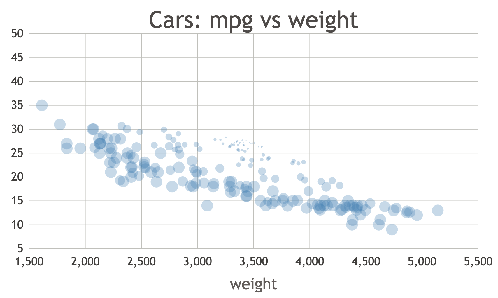
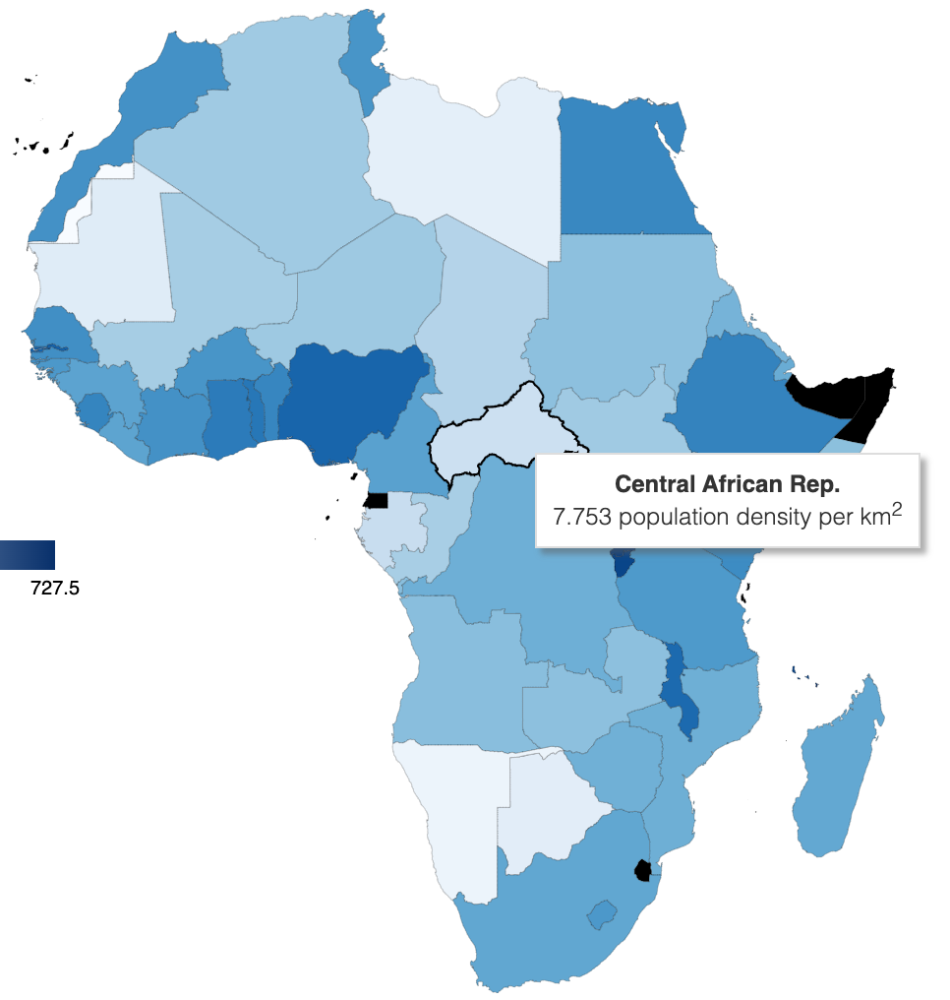
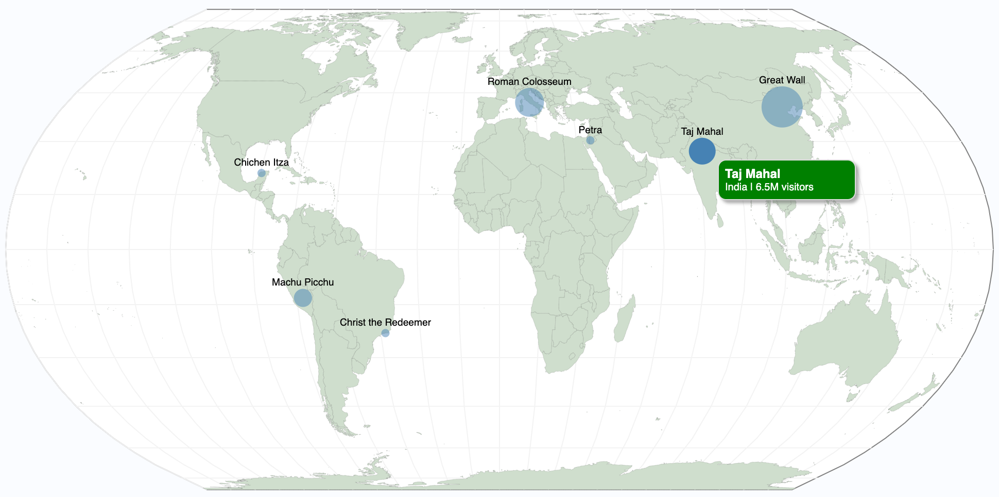

## Video: The Censored Radiohead Song

A short video I researched, wrote, and edited about the history and context surrounding Radiohead's song "Pop Is Dead", which ultimately garnered over 200k views. I was inspired to create it when I discovered the song through an unofficial Vimeo upload and realized I had never heard of it because the band had actively removed it from any official online record. In the video, I delve into how the song came about and why Radiohead might have decided that they didn't want it online.

## 31-EDO Digital Keyboard

I created this web synth to play with melodies and harmonies beyond the 12 notes of the Western scale. Specifically, the user can play notes tuned in 31-EDO (equal divisions of the octave) using their computer keyboard, allowing them to access 31 different notes instead of just 12. The user can also switch back to standard 12-EDO if they wish. Furthermore, this webpage functions as a simple synthesizer, with several options to customize the sound produced.
This is a spinoff of a project for my Computational Sound course.

Works best in Chrome.

## Fiction: In Memory of Peter Mettier
[Read the story here](https://williamyzhang.github.io/portfolio/files/in-memory-of-peter-mettier.pdf)

A short story I originally wrote for a creative writing group at Oxford. I aim to explore themes of memory, legacy, and ambition through a portrayal of life in the Midwest.

## Data Visualization Samples

Some examples of interactive data visualizations made in the JavaScript D3 library. Originally made for a class, with some modifications.

## Music: Instrumentals

<audio  id="dog days are over"
        preload="audio"
        src="../files/dog-days.wav"
></audio>